# 🛍️ لوکس‌شاپ (LuxShop) — فروشگاه اینترنتی مدرن

یک فروشگاه اینترنتی کامل و واکنش‌گرا با **HTML، CSS و JavaScript خالص** (بدون هیچ فریم‌ورکی). این پروژه شامل پنل کاربری، سبد خرید، پیگیری سفارش و پنل ادمین است.

🔗 **دموی آنلاین:** [https://raheleshirazi.github.io/luxShop](https://raheleshirazi.github.io/luxShop)

---

## 📸 پیش‌نمایش پروژه

### 🏠 صفحه اصلی

| نمای اول | امکانات |
|---|---|
| 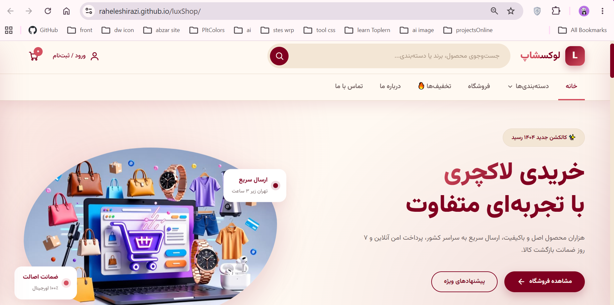 | 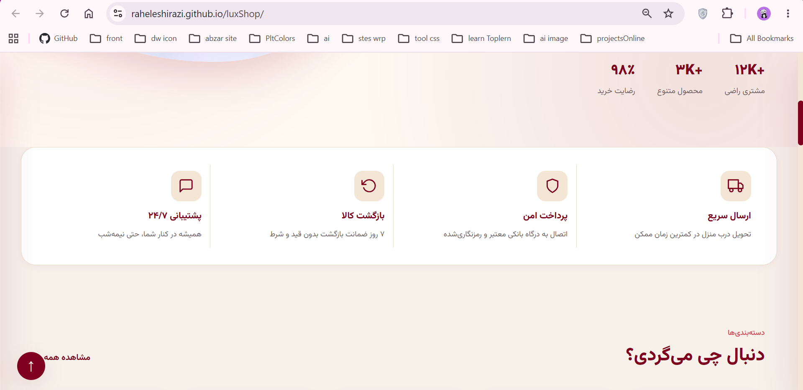 |

| دسته‌بندی‌ها | محصولات پرطرفدار |
|---|---|
| 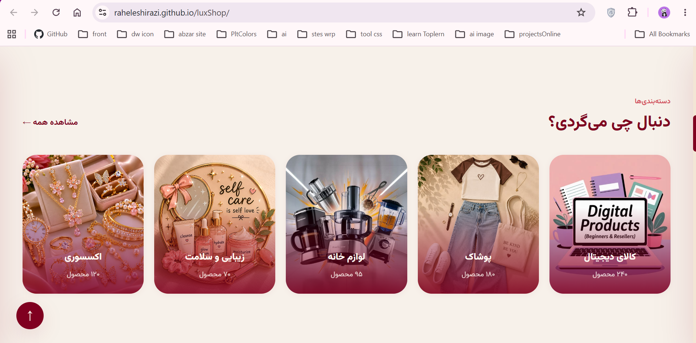 | 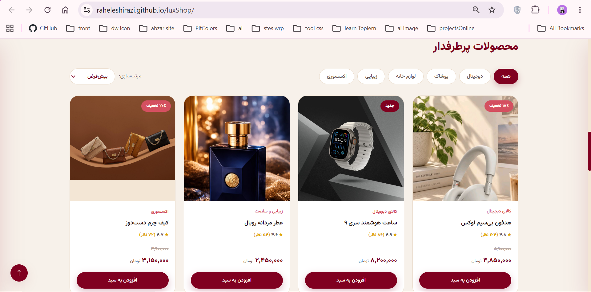 |

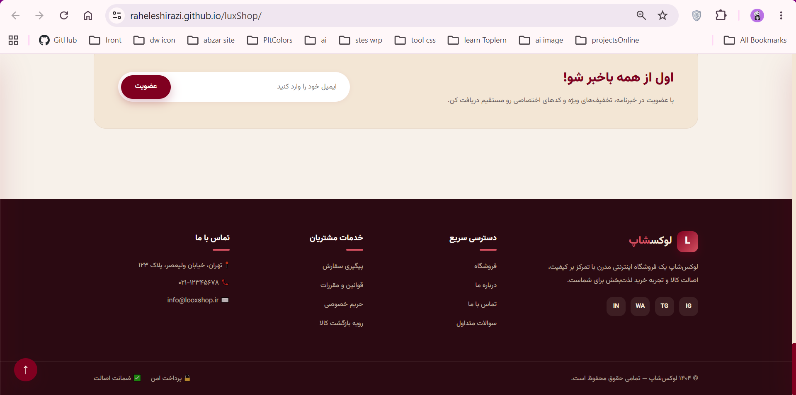

---

### 🔐 ورود و ثبت‌نام
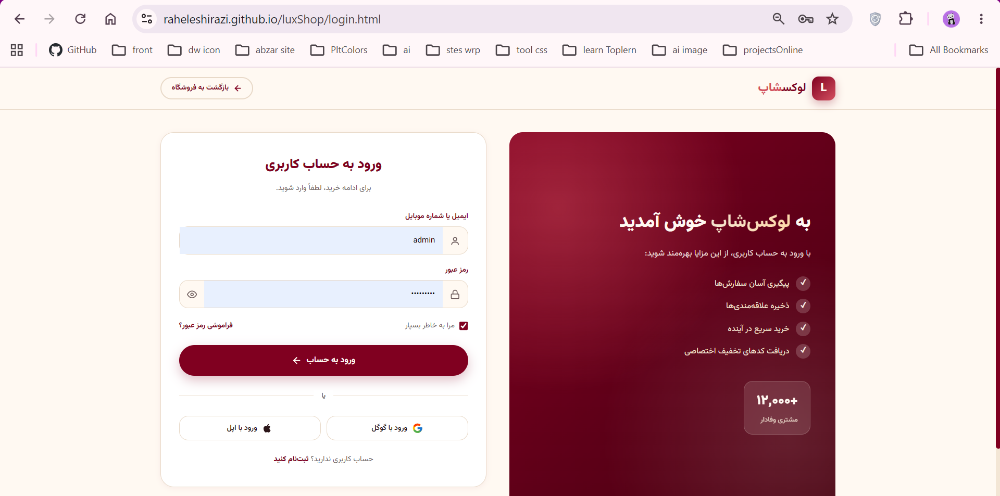

---

### 📦 صفحه محصول
| محصول ۱ | محصول ۲ |
|---|---|
| 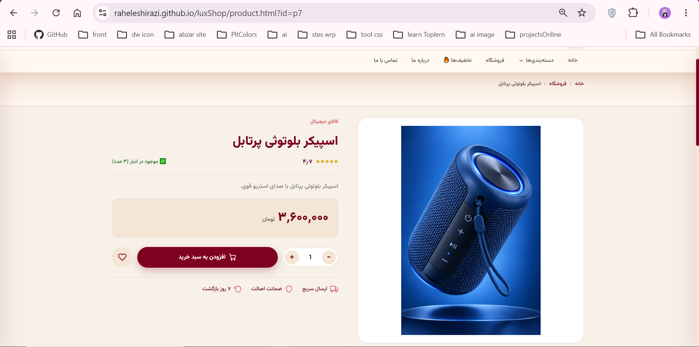 | 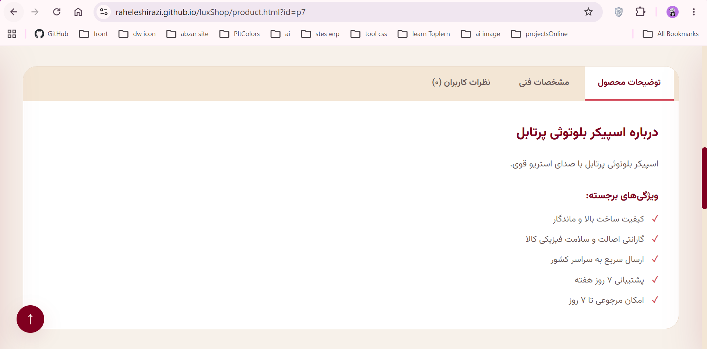 |

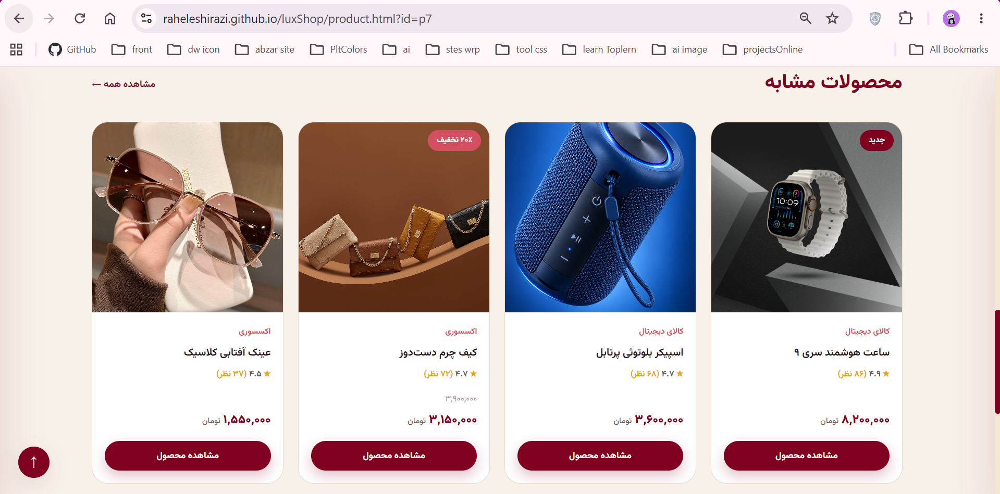

---

### 📋 پیگیری سفارش
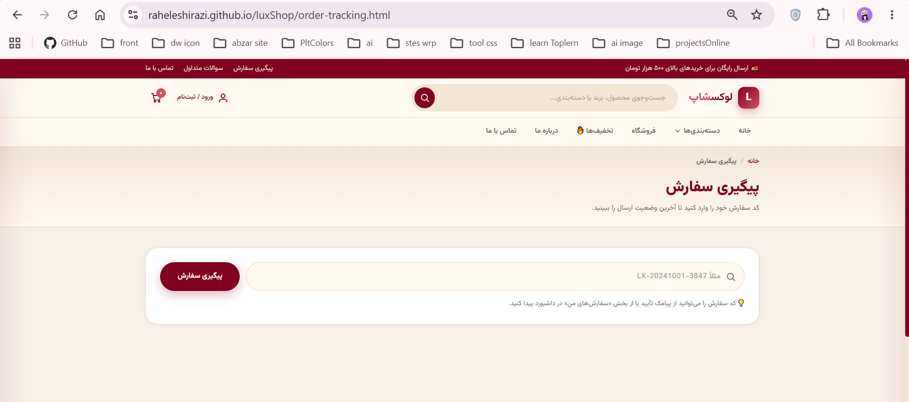

---

### ❓ سوالات متداول
| بخش اول | بخش دوم |
|---|---|
| 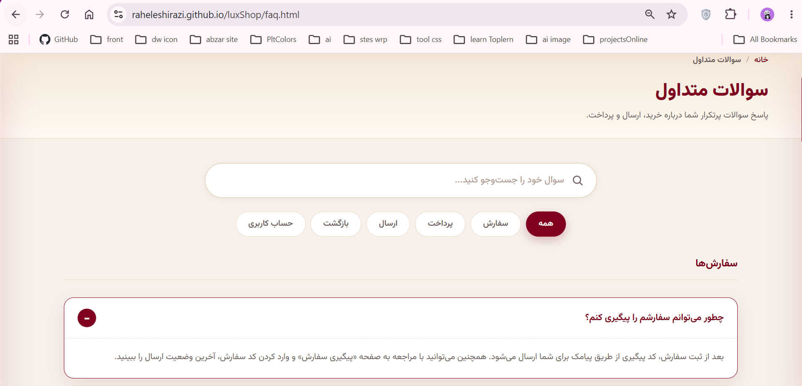 | 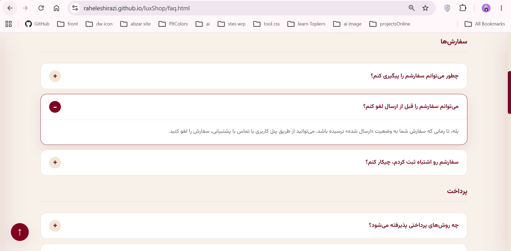 |

---

## ✨ امکانات پروژه

- 🛒 **سبد خرید کامل** با ذخیره‌سازی در LocalStorage
- 🔍 **جست‌وجو و فیلتر** محصولات
- 👤 **سیستم ثبت‌نام و ورود** کاربران
- 📦 **پیگیری سفارش** با کد رهگیری
- ⚙️ **پنل ادمین** برای مدیریت محصولات، سفارشات و کاربران
- ❓ **بخش سوالات متداول** تعاملی
- 📱 **طراحی کاملاً واکنش‌گرا** (موبایل، تبلت، دسکتاپ)
- 🔔 **سیستم اعلان Real-time** بین ادمین و کاربر
- 🎨 **طراحی مدرن و لاکچری** با رنگ‌بندی اختصاصی

---

## 🛠️ تکنولوژی‌های استفاده‌شده

---

## 📂 ساختار پروژه
